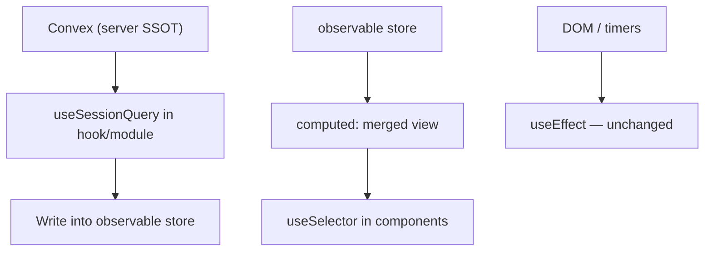

# Legend State Signals (Frontend)

This document is the reference for using [Legend State](https://legendapp.com/open-source/state/) signals in `apps/webapp`. The dependency is installed for downstream apps (e.g. chatroom) to adopt incrementally.

**Package:** `@legendapp/state` (React bindings: `@legendapp/state/react`)

---

## What problems signals solve

Most frontend coordination bugs come from **gluing one reactive system to another with `useEffect`** — especially:

| Bug pattern                    | Example                                                         | Why it breaks                                                        |
| ------------------------------ | --------------------------------------------------------------- | -------------------------------------------------------------------- |
| **Query → effect → setState**  | `useSessionQuery` result copied into `useState` via `useEffect` | Stale closures, wrong dependency arrays, reset races when IDs change |
| **Derived state sync**         | Two `useState` values kept in sync manually                     | Drift when one updates without the other                             |
| **Render-time setState**       | `if (prev !== x) { setPrev(x); setState(...) }` during render   | Ordering bugs, hard to test                                          |
| **Hand-rolled pub/sub stores** | `Map` + `listeners` + manual `emit`                             | Missing cleanup, duplicate subscriptions                             |

Signals address these with:

- **`observable()`** — mutable reactive cells (local store SSOT)
- **`computed()`** — derived values that auto-track dependencies (no sync effect)
- **`observe()` / `useObserve()`** — side effects that auto-track what they read (no dependency array)

### What signals do **not** replace

Keep standard React patterns for:

- DOM event listeners (`addEventListener`, `ResizeObserver`)
- Timers and debounce (`setTimeout`, `setInterval`)
- Router navigation (`router.push`)
- Focus management and mount-once imperatives
- **Convex as server SSOT** — use `useSessionQuery` / `useSessionMutation`; do not duplicate server sync with Legend's sync engine

---

## When to use signals

**Use signals for:**

1. **Local stores** that accumulate real-time deltas (message lists, file trees, streaming overlays)
2. **Bridging Convex → local state** — write query results into an observable in one place instead of `useEffect` + `dispatch`
3. **Derived views** of store data (`computed` for merged server + optimistic rows)
4. **Replacing hand-rolled listener maps** with observables

**Do not use signals for:**

- Simple dialog open/close booleans
- Controlled form inputs (unless part of a larger store)
- One-shot mount effects
- Replacing Convex queries entirely

---

## Architecture with Convex



**Rules:**

1. Convex owns server truth. Queries push **into** the local observable store.
2. Components read from the store via `useSelector`, not by copying query data into `useState`.
3. Prefer **one write site** per store (a hook or module function), not scattered `set()` calls.
4. Scope stores per entity ID (e.g. per `chatroomId`) and reset observables when the ID changes.

---

## API quick reference

### Create a store

```typescript
import { observable, computed } from '@legendapp/state';

type MessageStore = {
  messages: Message[];
  isInitialized: boolean;
};

export const messageStore$ = observable<MessageStore>({
  messages: [],
  isInitialized: false,
});

// Derived — no useEffect needed
export const newestMessage$ = computed(() => {
  const msgs = messageStore$.messages.get();
  return msgs.length > 0 ? msgs[msgs.length - 1] : null;
});
```

### React component — read reactive state

```tsx
'use client';

import { useSelector } from '@legendapp/state/react';
import { messageStore$, newestMessage$ } from './messageStore';

export function MessageCount() {
  const count = useSelector(() => messageStore$.messages.get().length);
  const newest = useSelector(newestMessage$);
  return (
    <span>
      {count} messages · latest: {newest?.content}
    </span>
  );
}
```

### React — reactive side effects (replaces coordination useEffect)

```tsx
'use client';

import { useObserve } from '@legendapp/state/react';
import { messageStore$ } from './messageStore';

// Runs when tailData$ changes; auto-tracks dependencies inside the callback
export function useMergeTailMessages(tailData: Message[] | undefined) {
  useObserve(() => {
    if (!tailData?.length) return;
    const existing = messageStore$.messages.get();
    messageStore$.messages.set(mergeById(existing, tailData));
  });
}
```

For non-React modules (store setup, Convex adapter):

```typescript
import { observe } from '@legendapp/state';

const dispose = observe(() => {
  const data = tailData$.get();
  if (data) messageStore$.messages.set(mergeById(messageStore$.messages.get(), data));
});

// dispose() on teardown (e.g. chatroom switch)
```

### Reset store on ID change

```typescript
import { useObserve } from '@legendapp/state/react';

export function useResetMessageStore(chatroomId: string) {
  useObserve(() => {
    chatroomId; // track
    messageStore$.set({ messages: [], isInitialized: false });
  });
}
```

Or reset imperatively when the ID changes in the owning hook — avoid leaving stale data from the previous entity.

---

## Migration pattern: query → effect → dispatch

**Before (bug-prone):**

```typescript
const tailData = useSessionQuery(api.messages.subscribeTail, cursor ? { after: cursor } : 'skip');

useEffect(() => {
  if (!tailData) return;
  dispatch({ type: 'MERGE_TAIL', messages: tailData });
}, [tailData]);
```

**After (observable store):**

```typescript
const tailData = useSessionQuery(api.messages.subscribeTail, cursor ? { after: cursor } : 'skip');

useObserve(() => {
  if (!tailData?.length) return;
  messageStore$.messages.set(mergeById(messageStore$.messages.get(), tailData));
});
```

Better still: isolate the write in a dedicated hook (`useMessageStoreSync`) so components only `useSelector` the store.

---

## File placement

| Artifact                    | Location                                                  |
| --------------------------- | --------------------------------------------------------- |
| Observable stores           | `apps/webapp/src/modules/<feature>/<name>Store.ts`        |
| Store + Convex wiring hooks | `apps/webapp/src/modules/<feature>/use<Name>Store.ts`     |
| Components                  | `useSelector` only — no direct Convex → `useState` copies |

Mark store modules `'use client'` when they import React hooks. Pure `observable` / `computed` modules can stay hook-free for easier testing.

---

## Testing

- Test `computed` and merge helpers as pure functions (pass plain arrays/objects).
- Test store reducers by calling `.get()` / `.set()` on observables without React.
- Use `observe` disposal in tests to avoid leaking subscriptions.

---

## Further reading

- [Legend State docs](https://legendapp.com/open-source/state/)
- [Fine-grained Reactivity](https://legendapp.com/open-source/state/v3/react/fine-grained-reactivity/)
- Internal auth/query patterns: [auth-session-helpers.md](./auth-session-helpers.md)
