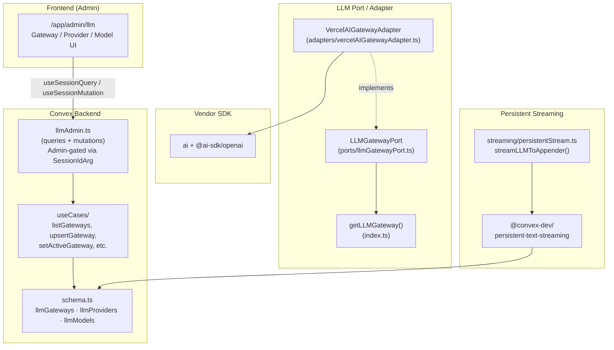
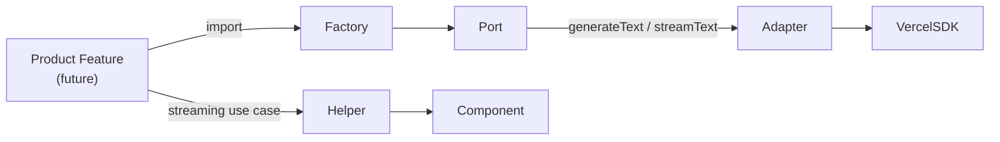

# LLM Infrastructure

Developer guide for the LLM provider configuration infrastructure. This covers the architecture, extension points, and how product features consume LLMs through the port/adapter boundary.

## Overview

This infrastructure provides a **centralised, admin-managed** configuration layer for LLM providers, wrapped behind a port/adapter boundary so the underlying provider SDK can be swapped without touching product code.

**What this includes:**

- Database schema for gateways, providers, and models (Convex tables)
- `LLMGatewayPort` interface (the contract all gateways implement)
- `VercelAIGatewayAdapter` — first adapter wrapping the [Vercel AI SDK](https://sdk.vercel.ai)
- Convex `persistent-text-streaming` component wired with a generic helper
- Admin-only Convex API for CRUD on gateways/providers/models
- System admin UI at `/app/admin/llm`

**What this does NOT include:**

- Any end-user product features (chat, completions, etc.)
- A built-in chat UI
- Multi-tenant provider configurations

## Architecture



**Product code consumption path:**



## Entities

Three tables form the configuration hierarchy: **Gateway → Provider → Model**.

### `llmGateways`

| Field       | Type                                     | Notes                                   |
| ----------- | ---------------------------------------- | --------------------------------------- |
| `kind`      | `"vercel-ai-gateway"` (extensible union) | Discriminated union for future gateways |
| `label`     | `string`                                 | Display name                            |
| `isActive`  | `boolean`                                | Exactly one row must be `true`          |
| `createdAt` | `number`                                 | Unix timestamp                          |
| `updatedAt` | `number`                                 | Unix timestamp                          |

**Invariant:** At most one gateway may be `isActive: true`. Enforced in `setActiveGateway`.

### `llmProviders`

| Field          | Type                | Notes                          |
| -------------- | ------------------- | ------------------------------ |
| `gatewayId`    | `Id<"llmGateways">` | FK to parent gateway           |
| `slug`         | `string`            | e.g. `"openai"`, `"anthropic"` |
| `label`        | `string`            | Display name                   |
| `apiKeyEnvVar` | `string?`           | Env var holding the API key    |
| `isEnabled`    | `boolean`           | Admin toggle                   |
| `createdAt`    | `number`            |                                |
| `updatedAt`    | `number`            |                                |

Index: `by_gatewayId` on `["gatewayId"]`.

### `llmModels`

| Field        | Type                 | Notes                                  |
| ------------ | -------------------- | -------------------------------------- |
| `providerId` | `Id<"llmProviders">` | FK to parent provider                  |
| `slug`       | `string`             | e.g. `"gpt-4o"`, `"claude-sonnet-4-5"` |
| `label`      | `string`             | Display name                           |
| `isEnabled`  | `boolean`            | Admin toggle                           |
| `isDefault`  | `boolean`            | One per provider may be default        |
| `createdAt`  | `number`             |                                        |
| `updatedAt`  | `number`             |                                        |

Index: `by_providerId` on `["providerId"]`.

**Invariant:** At most one model per provider may be `isDefault: true`. Enforced in `setDefaultModel`.

## Adding a New Gateway

1. **Define a new kind** — Add your literal to the `kind` union in `services/backend/convex/schema.ts` and the `LLMGatewayKind` type in `services/backend/application/llm/entities/gateway.ts`.

2. **Implement the port** — Create an adapter in `services/backend/application/llm/adapters/` that implements `LLMGatewayPort`:

   ```ts
   import type { LLMGatewayPort } from '../ports/llmGatewayPort';

   export class MyNewGatewayAdapter implements LLMGatewayPort {
     async generateText(req) {
       /* ... */
     }
     async *streamText(req) {
       /* ... */
     }
   }
   ```

3. **Register in the factory** — Update `services/backend/application/llm/index.ts` so `getLLMGateway()` can return your adapter. Today the factory always returns `VercelAIGatewayAdapter`; the intent is to eventually read the active gateway from the database and instantiate the matching adapter.

4. **Surface in the admin UI** — The gateway picker in `GatewaySection.tsx` reads from `llmGateways`. No code changes needed if your adapter is returned by the factory based on the active gateway's `kind`.

## Adding a New Provider

The adapter's `PROVIDER_FACTORIES` map in `services/backend/application/llm/adapters/vercelAIGatewayAdapter.ts` currently only supports `openai`. To add a new provider (e.g. Anthropic):

1. Install the provider SDK:

   ```bash
   pnpm --filter backend add @ai-sdk/anthropic
   ```

2. Register it in the adapter:

   ```ts
   import { createAnthropic } from '@ai-sdk/anthropic';

   const PROVIDER_FACTORIES: Record<string, (apiKey?: string) => ReturnType<typeof createOpenAI>> =
     {
       openai: (apiKey) => createOpenAI({ apiKey: apiKey ?? process.env.OPENAI_API_KEY }),
       // ADD:
       anthropic: (apiKey) => createAnthropic({ apiKey: apiKey ?? process.env.ANTHROPIC_API_KEY }),
     };
   ```

3. Add the provider via the admin UI (`/app/admin/llm`) with slug `"anthropic"` and the appropriate API key env var.

## Consuming the LLM in a Product Feature

### One-shot generation

```ts
import { getLLMGateway } from '../application/llm';

const gateway = getLLMGateway();
const result = await gateway.generateText({
  modelSlug: 'gpt-4o',
  providerSlug: 'openai',
  prompt: 'Summarise this document...',
  system: 'You are a helpful assistant.',
});
// result.text → the generated text
// result.usage → token counts (if available)
```

### Streaming via persistent-text-streaming

For features that need **durable streaming** (survives disconnects, page reloads, viewable by multiple users):

```ts
import { PersistentTextStreaming } from '@convex-dev/persistent-text-streaming';
import { getLLMGateway } from '../application/llm';
import { streamLLMToAppender } from '../application/llm/streaming/persistentStream';

const streaming = new PersistentTextStreaming(components.persistentTextStreaming);
const gateway = getLLMGateway();

export const myStreamAction = httpAction(async (ctx, request) => {
  const { streamId } = await request.json();
  return streaming.stream(ctx, request, streamId, async (_ctx, _req, _id, append) => {
    await streamLLMToAppender(
      gateway,
      {
        modelSlug: 'gpt-4o',
        providerSlug: 'openai',
        prompt: 'Tell me a story...',
      },
      append
    );
  });
});
```

On the client, use the `useStream` hook from `@convex-dev/persistent-text-streaming/react` to subscribe to the stream.

## Why a Port / Adapter?

The `LLMGatewayPort` interface is a **hexagonal boundary**. All product code depends on the port, never on a specific vendor SDK.

- **Swappability** — Switch from Vercel AI Gateway to a direct provider or self-hosted model by writing a new adapter.
- **Testability** — Mock the port in unit tests without spinning up a real LLM.
- **Vendor lock-in prevention** — The Vercel AI SDK (`ai`, `@ai-sdk/*`) must only be imported inside `adapters/vercelAIGatewayAdapter.ts`. Any import of these packages elsewhere is a violation.

## Admin Operations

System admins manage the LLM configuration at **`/app/admin/llm`** (requires `system_admin` access level).

| Action             | UI                            | Convex function          |
| ------------------ | ----------------------------- | ------------------------ |
| Add a gateway      | Click "Add Vercel AI Gateway" | `createOrUpdateGateway`  |
| Set active gateway | Radio group selection         | `activateGateway`        |
| Add a provider     | "Add Provider" dialog         | `createOrUpdateProvider` |
| Toggle provider    | Switch in providers table     | `enableProvider`         |
| Add a model        | "Add Model" dialog            | `createOrUpdateModel`    |
| Toggle model       | Switch in models table        | `enableModel`            |
| Set default model  | Star button in models table   | `makeDefaultModel`       |

All admin endpoints are gated by `SessionIdArg` + `isSystemAdmin()`. Non-admin requests receive a `FORBIDDEN` ConvexError.

## File Reference

| Layer         | Path                                                                                    |
| ------------- | --------------------------------------------------------------------------------------- |
| Schema        | `services/backend/convex/schema.ts` (tables `llmGateways`, `llmProviders`, `llmModels`) |
| Entities      | `services/backend/application/llm/entities/`                                            |
| Port          | `services/backend/application/llm/ports/llmGatewayPort.ts`                              |
| Adapter       | `services/backend/application/llm/adapters/vercelAIGatewayAdapter.ts`                   |
| Factory       | `services/backend/application/llm/index.ts`                                             |
| Use cases     | `services/backend/application/llm/useCases/`                                            |
| Streaming     | `services/backend/application/llm/streaming/persistentStream.ts`                        |
| Admin API     | `services/backend/convex/llmAdmin.ts`                                                   |
| Admin UI      | `apps/webapp/src/app/app/admin/llm/page.tsx`                                            |
| UI components | `apps/webapp/src/application/llm-admin/`                                                |
| Component     | `services/backend/convex/convex.config.ts` (registered as `persistentTextStreaming`)    |
