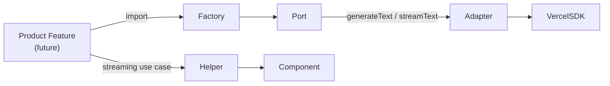

# LLM Infrastructure

Developer guide for the LLM provider configuration infrastructure. This covers the architecture, extension points, and how product features consume LLMs through the port/adapter boundary.

## Overview

This infrastructure provides a **centralised, admin-managed** configuration layer for LLM providers, wrapped behind a port/adapter boundary so the underlying provider SDK can be swapped without touching product code.

**What this includes:**

- Database schema for gateways, providers, and models (Convex tables)
- `LLMGatewayPort` interface (the contract all gateways implement)
- `VercelAIGatewayAdapter` — first adapter wrapping the [Vercel AI SDK](https://sdk.vercel.ai)
- Convex `persistent-text-streaming` component wired with a generic helper
- Admin-only Convex API for CRUD on gateways/providers/models
- System admin UI at `/app/admin/llm`

**What this does NOT include:**

- Any end-user product features (chat, completions, etc.)
- A built-in chat UI
- Multi-tenant provider configurations

> **Model discovery is dynamic.** Models are fetched from the Vercel AI Gateway via `gateway.getAvailableModels()` and surfaced in the admin UI. Admins enable models from the live list — no manual slug entry.

## Architecture

```mermaid
graph TB
    subgraph "Frontend (Admin)"
        UI["/app/admin/llm<br/>3-card UX:<br/>GatewayStatusCard<br/>ModelCatalog<br/>ConfigSummaryCard"]
    end

    subgraph "Convex Backend"
        Action["getAvailableModelsFromGateway<br/>(action — HTTP call)"]
        AdminAPI["llmAdmin.ts<br/>(queries + mutations)<br/>Admin-gated via SessionIdArg"]
        UseCases["useCases/<br/>enableCatalogModel, getCatalog,<br/>listGateways, upsertGateway, etc."]
        Schema["schema.ts<br/>llmGateways · llmProviders · llmModels"]
        Action -->|ctx.runQuery (requireAdminAck)| AdminAPI
        AdminAPI --> UseCases --> Schema
        UI -->|useSessionQuery / useSessionMutation<br/>useSessionAction| AdminAPI
        UI -->|useSessionAction| Action
    end

    subgraph "LLM Port / Adapter"
        Port["LLMGatewayPort<br/>(ports/llmGatewayPort.ts)"]
        Adapter["VercelAIGatewayAdapter<br/>(adapters/vercelAIGatewayAdapter.ts)"]
        Factory["createGatewayPort() + getLLMGateway()<br/>(index.ts)"]
        Port --> Factory
        Adapter -.->|implements| Port
    end

    subgraph "Vendor SDK"
        VercelSDK["ai + @ai-sdk/openai<br/>gateway.getAvailableModels()"]
    end

    subgraph "Persistent Streaming"
        Component["@convex-dev/<br/>persistent-text-streaming"]
        Helper["streaming/persistentStream.ts<br/>streamLLMToAppender()"]
        Helper --> Component
        Component --> Schema
    end

    Action --> Factory --> Adapter --> VercelSDK
    Adapter --> VercelSDK
```

**Product code consumption path:**



## Admin Flow

The admin UI at `/app/admin/llm` uses a three-card layout:

| Card                      | Component           | Purpose                                                        |
| ------------------------- | ------------------- | -------------------------------------------------------------- |
| **Gateway**               | `GatewayStatusCard` | Connect to Vercel AI Gateway, sync models                      |
| **Available Models**      | `ModelCatalog`      | Browse models grouped by provider, enable/disable, set default |
| **Current Configuration** | `ConfigSummaryCard` | Read-only summary of what the application will use             |

**Key behaviours:**

- Admins do **not** manually type model slugs — the catalog is populated by calling `gateway.getAvailableModels()` via the `getAvailableModelsFromGateway` action.
- The `setCatalogModelEnabled` mutation auto-creates the provider and model records on first enable. Toggling a second time disables without deleting.
- The "Sync available models" button fetches the full list from the Vercel AI Gateway. This requires the `AI_GATEWAY_API_KEY` environment variable to be set.

**Admin gating:** All admin endpoints use `SessionIdArg` + `isSystemAdmin()`. The action gates before any external HTTP call via an internal query (`requireAdminAck`).

## Entities

Three tables form the configuration hierarchy: **Gateway → Provider → Model**.

### `llmGateways`

| Field       | Type                                     | Notes                                   |
| ----------- | ---------------------------------------- | --------------------------------------- |
| `kind`      | `"vercel-ai-gateway"` (extensible union) | Discriminated union for future gateways |
| `label`     | `string`                                 | Display name                            |
| `isActive`  | `boolean`                                | Exactly one row must be `true`          |
| `createdAt` | `number`                                 | Unix timestamp                          |
| `updatedAt` | `number`                                 | Unix timestamp                          |

**Invariant:** At most one gateway may be `isActive: true`. Enforced in `setActiveGateway`.

### `llmProviders`

| Field          | Type                | Notes                                                                 |
| -------------- | ------------------- | --------------------------------------------------------------------- |
| `gatewayId`    | `Id<"llmGateways">` | FK to parent gateway                                                  |
| `slug`         | `string`            | Sourced from the gateway model id (before first `/`). e.g. `"openai"` |
| `label`        | `string`            | Provider slug used as default label; can be overridden                |
| `apiKeyEnvVar` | `string?`           | Env var holding the API key                                           |
| `isEnabled`    | `boolean`           | Admin toggle                                                          |
| `createdAt`    | `number`            |                                                                       |
| `updatedAt`    | `number`            |                                                                       |

Index: `by_gatewayId` on `["gatewayId"]`.

Providers are **auto-created** by `enableCatalogModel` when an admin enables the first model for a given provider slug.

### `llmModels`

| Field        | Type                 | Notes                                                                |
| ------------ | -------------------- | -------------------------------------------------------------------- |
| `providerId` | `Id<"llmProviders">` | FK to parent provider                                                |
| `slug`       | `string`             | Sourced from the gateway model id (after first `/`). e.g. `"gpt-4o"` |
| `label`      | `string`             | Sourced from the gateway model `name`. e.g. `"GPT-4o"`               |
| `isEnabled`  | `boolean`            | Admin toggle                                                         |
| `isDefault`  | `boolean`            | One per provider may be default                                      |
| `createdAt`  | `number`             |                                                                      |
| `updatedAt`  | `number`             |                                                                      |

Index: `by_providerId` on `["providerId"]`.

**Invariant:** At most one model per provider may be `isDefault: true`. Enforced in `setDefaultModel`.

## Adding a New Gateway

1. **Define a new kind** — Add your literal to the `kind` union in `services/backend/convex/schema.ts` and the `LLMGatewayKind` type in `services/backend/application/llm/entities/gateway.ts`.

2. **Implement the port** — Create an adapter in `services/backend/application/llm/adapters/` that implements `LLMGatewayPort`:

   ```ts
   import type { LLMGatewayPort } from '../ports/llmGatewayPort';

   export class MyNewGatewayAdapter implements LLMGatewayPort {
     async generateText(req) {
       /* ... */
     }
     async *streamText(req) {
       /* ... */
     }
   }
   ```

3. **Register in the factory** — Update `services/backend/application/llm/index.ts` so `getLLMGateway()` can return your adapter. Today the factory always returns `VercelAIGatewayAdapter`; the intent is to eventually read the active gateway from the database and instantiate the matching adapter.

4. **Surface in the admin UI** — The gateway status is displayed in `GatewayStatusCard.tsx`. No code changes needed if your adapter is returned by the factory based on the active gateway's `kind`.

## Adding a New Provider

The adapter's `PROVIDER_FACTORIES` map in `services/backend/application/llm/adapters/vercelAIGatewayAdapter.ts` governs which provider slugs can be used with `generateText` and `streamText`. The gateway's `getAvailableModels()` may return models from many providers — the factory map must be extended for each one product features intend to call.

| Provider slug | SDK package      | Factory function | Env var          |
| ------------- | ---------------- | ---------------- | ---------------- |
| `openai`      | `@ai-sdk/openai` | `createOpenAI`   | `OPENAI_API_KEY` |

To add a new provider (e.g. Anthropic):

1. Install the provider SDK:

   ```bash
   pnpm --filter backend add @ai-sdk/anthropic
   ```

2. Register it in the adapter:

   ```ts
   import { createAnthropic } from '@ai-sdk/anthropic';

   const PROVIDER_FACTORIES: Record<string, (apiKey?: string) => ReturnType<typeof createOpenAI>> =
     {
       openai: (apiKey) => createOpenAI({ apiKey: apiKey ?? process.env.OPENAI_API_KEY }),
       // ADD:
       anthropic: (apiKey) => createAnthropic({ apiKey: apiKey ?? process.env.ANTHROPIC_API_KEY }),
     };
   ```

3. Models for that provider will appear in the admin catalog on the next sync. Enable them from the UI — no manual slug entry needed.

## Why a Port / Adapter?

The `LLMGatewayPort` interface is a **hexagonal boundary**. All product code depends on the port, never on a specific vendor SDK.

- **Swappability** — Switch from Vercel AI Gateway to a direct provider or self-hosted model by writing a new adapter.
- **Testability** — Mock the port in unit tests without spinning up a real LLM.
- **Vendor lock-in prevention** — The Vercel AI SDK (`ai`, `@ai-sdk/*`) must only be imported inside `adapters/vercelAIGatewayAdapter.ts`. Any import of these packages elsewhere is a violation.

## Admin Operations

System admins manage the LLM configuration at **`/app/admin/llm`** (requires `system_admin` access level).

| Action               | UI                                                     | Convex function                                |
| -------------------- | ------------------------------------------------------ | ---------------------------------------------- |
| Set up gateway       | "Set up Vercel AI Gateway" button in GatewayStatusCard | `createOrUpdateGateway`, `activateGateway`     |
| Sync models          | "Sync available models" button in GatewayStatusCard    | `getAvailableModelsFromGateway` (action)       |
| Enable/disable model | Switch in ModelCatalog per-model row                   | `setCatalogModelEnabled`                       |
| Set default model    | Radio in ModelCatalog per-provider RadioGroup          | `makeDefaultModel`                             |
| View configuration   | ConfigSummaryCard (read-only)                          | `getCatalogQuery`, `getProviders`, `getModels` |

All admin endpoints are gated by `SessionIdArg` + `isSystemAdmin()`. The `getAvailableModelsFromGateway` action gates via `requireAdminAck` internal query before making any external HTTP call. Non-admin requests receive a `FORBIDDEN` ConvexError.

## Consumption Pattern (Recap)

For product features consuming the LLM infrastructure, the port/adapter boundary abstracts away the provider SDK:

### One-shot generation

```ts
import { getLLMGateway } from '../application/llm';

const gateway = getLLMGateway();
const result = await gateway.generateText({
  modelSlug: 'gpt-4o',
  providerSlug: 'openai',
  prompt: 'Summarise this document...',
  system: 'You are a helpful assistant.',
});
```

### Streaming via persistent-text-streaming

```ts
import { PersistentTextStreaming } from '@convex-dev/persistent-text-streaming';
import { getLLMGateway } from '../application/llm';
import { streamLLMToAppender } from '../application/llm/streaming/persistentStream';

const streaming = new PersistentTextStreaming(components.persistentTextStreaming);
const gateway = getLLMGateway();

export const myStreamAction = httpAction(async (ctx, request) => {
  const { streamId } = await request.json();
  return streaming.stream(ctx, request, streamId, async (_ctx, _req, _id, append) => {
    await streamLLMToAppender(
      gateway,
      { modelSlug: 'gpt-4o', providerSlug: 'openai', prompt: 'Tell me a story...' },
      append
    );
  });
});
```

On the client, use the `useStream` hook from `@convex-dev/persistent-text-streaming/react` to subscribe to the stream.

## File Reference

| Layer         | Path                                                                                    |
| ------------- | --------------------------------------------------------------------------------------- |
| Schema        | `services/backend/convex/schema.ts` (tables `llmGateways`, `llmProviders`, `llmModels`) |
| Entities      | `services/backend/application/llm/entities/`                                            |
| Port          | `services/backend/application/llm/ports/llmGatewayPort.ts`                              |
| Adapter       | `services/backend/application/llm/adapters/vercelAIGatewayAdapter.ts`                   |
| Factory       | `services/backend/application/llm/index.ts`                                             |
| Use cases     | `services/backend/application/llm/useCases/`                                            |
| Catalog       | `services/backend/application/llm/useCases/catalogUseCases.ts`                          |
| Streaming     | `services/backend/application/llm/streaming/persistentStream.ts`                        |
| Admin API     | `services/backend/convex/llmAdmin.ts`                                                   |
| Admin UI page | `apps/webapp/src/app/app/admin/llm/page.tsx`                                            |
| UI Gateway    | `apps/webapp/src/application/llm-admin/GatewayStatusCard.tsx`                           |
| UI Catalog    | `apps/webapp/src/application/llm-admin/ModelCatalog.tsx`                                |
| UI Summary    | `apps/webapp/src/application/llm-admin/ConfigSummaryCard.tsx`                           |
