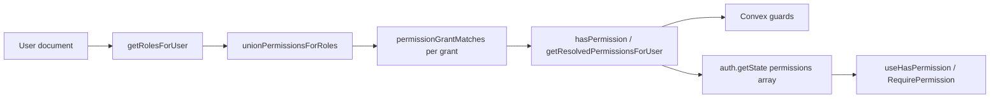

# Define New Roles and Permissions

This guide explains how to define application permissions and roles, enforce them in Convex, and use them in the Next.js webapp. RBAC is **declarative and code-defined** in `application/auth/` — not stored in database tables in the current phase.

## Reference implementation (Phase 1b)

Forks and downstream repos adopting multi-role assignment should use [**PR #94 — feat(rbac): add users.roleNames for multi-role assignment (Phase 1b)**](https://github.com/conradkoh/next-convex-starter-app/pull/94) as the canonical change set. That PR introduces:

- `roleNames` optional array on `users` (Convex schema)
- `getRolesForUser` resolution: `accessLevel: 'system_admin'` first (no migration required for system admins), then `roleNames`, then default `['user']`
- `manager` role in `roleDefinitions` (backend + webapp)
- `backfillUserRoleNames` migration for non-admin users
- Unit tests in `application/auth/resolve.spec.ts` and `rbac-registry-sync.spec.ts`

Port that diff when bringing the same capability into another repo.

---

## Architecture

| Concept                 | Location                                    | Purpose                                                       |
| ----------------------- | ------------------------------------------- | ------------------------------------------------------------- |
| **Permission registry** | `permissions.ts`                            | Canonical list of permission keys and descriptions            |
| **Role definitions**    | `roles.ts`                                  | Maps each role to permission grants                           |
| **Resolution**          | `resolve.ts`                                | Derives roles from the user, unions grants, matches wildcards |
| **Backend guards**      | `requirePermission.ts`                      | Throws `FORBIDDEN` / `UNAUTHORIZED` in Convex handlers        |
| **Frontend hooks**      | `usePermission.ts`, `RequirePermission.tsx` | UI gating from server-resolved `AuthState.permissions`        |

**Backend:** `services/backend/application/auth/`  
**Frontend:** `apps/webapp/src/application/auth/` (mirrors backend)

Permissions flow to the client via `auth.getState`, which includes `permissions: Permission[]` resolved on the server with `getResolvedPermissionsForUser`. The webapp must **not** re-derive permissions from `accessLevel` in new code — use `authState.permissions` or the helpers below.

---

## Check permissions, not roles

**Authorization gates must use permission keys**, not role names (`system_admin`, `manager`, etc.) or `accessLevel`. Roles are how grants are grouped; permissions are what you enforce.

| Do                                                                      | Don't                                                 |
| ----------------------------------------------------------------------- | ----------------------------------------------------- |
| `requireAuthenticatedPermission(user, AUTH_PROVIDER_MANAGE_PERMISSION)` | `if (getRolesForUser(user).includes('system_admin'))` |
| `useHasPermission(SYSTEM_ADMIN_ACCESS_PERMISSION)`                      | `authState.accessLevel === 'system_admin'`            |
| Import constants from `permissions.ts`                                  | Hard-code role strings in handlers or UI              |

`getRolesForUser` and `accessLevel` exist only for **assignment** during Phase 1 (legacy field → built-in roles). They are not part of the public webapp auth API.

---

## System administrator vs business administrator

**Do not use bare `admin` in permission keys, role names, or variable names** unless you mean a future **business/org administrator** (e.g. managing their team’s attendance).

| Term                                | Meaning                                                     | Examples in this codebase                                                                                   |
| ----------------------------------- | ----------------------------------------------------------- | ----------------------------------------------------------------------------------------------------------- |
| **System administrator**            | Platform operator with access to system-wide configuration  | Role `system_admin`, `accessLevel: 'system_admin'`, permission `system_admin:access`, `<RequirePermission>` |
| **Business administrator** (future) | Org-scoped admin for product features — not implemented yet | Prefer names like `org_admin`, `workspace:admin`, or `attendance:admin` — never `admin` alone               |

The route `/app/admin` is historical URL naming for the **system admin portal**; new code should say “system admin” in UI copy, types, and permissions.

---

## Permission and role naming

Use `resource:action` with a colon separator:

| Example                | Meaning                                                            |
| ---------------------- | ------------------------------------------------------------------ |
| `users:list`           | List users                                                         |
| `users:read`           | View a user                                                        |
| `settings:write`       | Update settings                                                    |
| `auth:provider:manage` | Configure auth providers (nested resource segments are fine)       |
| `system_admin:access`  | Enter platform system administration UI (`system_admin` role only) |

**Wildcards** (in role grants only, not in the permission registry):

| Grant     | Effect                                                |
| --------- | ----------------------------------------------------- |
| `*`       | Matches every registered permission                   |
| `users:*` | Matches any permission whose key starts with `users:` |

`system_admin` does **not** use a wildcard. It uses `systemAdminPermissions`, which must list every key in the registry (enforced by tests).

---

## Keep backend and webapp in sync

`permissions.ts` and `roles.ts` must be **identical** in both packages. The webapp test `rbac-registry-sync.spec.ts` fails CI if they drift.

When you change either file, update **both**:

- `services/backend/application/auth/permissions.ts`
- `apps/webapp/src/application/auth/permissions.ts`

(and the matching `roles.ts` pair).

---

## Add a new permission

### 1. Register the permission (both packages)

Add a key and description to `permissions.ts`:

```typescript
export const permissions = {
  // ...existing keys
  'reports:read': { description: 'View reports' },
} as const;
```

The `Permission` type is `keyof typeof permissions` — TypeScript will require you to use only registered keys in guards and hooks.

### 2. Grant it to roles (both `roles.ts` files)

**Default `user` role** — add to that role’s `permissions` array if all signed-in users should have it:

```typescript
{
  role: 'user',
  permissions: ['attendance:read', 'presentation:read', 'reports:read'] as const satisfies readonly Permission[],
},
```

**`system_admin`** — no extra step if you use `systemAdminPermissions`:

```typescript
export const systemAdminPermissions = [...allPermissions] as const satisfies readonly Permission[];
```

Adding a registry key automatically expands `systemAdminPermissions` because it spreads `allPermissions`.

**Other roles** — add the permission to that role’s `permissions` array (see [Add a new role](#add-a-new-role)).

### 3. Guard backend handlers

Prefer `requireAuthenticatedPermission` when you already have the user document from session auth:

```typescript
import { requireAuthenticatedPermission } from '../../../application/auth';
import { getAuthUserOptional } from '../../../modules/auth/getAuthUser';

const REPORTS_READ = 'reports:read' as const;

export const listReports = query({
  args: { ...SessionIdArg },
  handler: async (ctx, args) => {
    const user = await getAuthUserOptional(ctx, args);
    requireAuthenticatedPermission(user, REPORTS_READ, {
      unauthorizedMessage: 'You must be logged in to view reports',
    });
    // ...
  },
});
```

Use `requirePermission` when you only have a `userId`:

```typescript
import { requirePermission } from '../../../application/auth';

await requirePermission(ctx, userId, 'reports:read');
```

On failure, callers receive a `ConvexError` with `code: 'FORBIDDEN'` or `'UNAUTHORIZED'`.

**Reference:** `services/backend/convex/system/auth/google.ts` — all handlers require `auth:provider:manage`.

### 4. Expose or hide UI on the frontend

```tsx
import { useHasPermission, RequirePermission } from '@/application/auth';

function ReportsNavLink() {
  const canRead = useHasPermission('reports:read');
  if (!canRead) return null;
  return <Link href="/reports">Reports</Link>;
}

function ReportsPage() {
  return (
    <RequirePermission permission="reports:read">
      <ReportsList />
    </RequirePermission>
  );
}
```

- `useHasPermission` — boolean for conditional rendering (e.g. `UserMenu.tsx` system-admin link with `system_admin:access`).
- `RequirePermission` — wraps content; optional `fallback` prop; default shows an access-denied card.
- System admin layout (`app/app/admin/layout.tsx`) — `RequirePermission` with `system_admin:access` plus login redirect for unauthenticated users.

### 5. Verify

```bash
pnpm typecheck
pnpm test
```

Relevant tests: `application/auth/resolve.spec.ts`, `rbac-registry-sync.spec.ts`.

---

## Add a new role

### 1. Define the role (both `roles.ts` files)

Append to `roleDefinitions`:

```typescript
export const roleDefinitions = [
  {
    role: 'user',
    permissions: [/* ... */] as const satisfies readonly Permission[],
  },
  {
    role: 'manager',
    permissions: [
      'users:list',
      'users:read',
      'attendance:manage',
    ] as const satisfies readonly Permission[],
  },
  { role: 'system_admin', permissions: systemAdminPermissions },
] as const;
```

`AppRole` is inferred from `roleDefinitions`. Use `satisfies readonly Permission[]` so invalid keys fail at compile time.

Wildcards are allowed in grants:

```typescript
permissions: ['users:*', 'attendance:read'] as const satisfies readonly RolePermissionGrant[],
```

### 2. Assign roles to users

**Phase 1b (current):** `roleNames` on `users` is the primary assignment field for non-admin users. Set an array of role strings matching keys in `roleDefinitions`:

| `roleNames` value     | Resolved roles                |
| --------------------- | ----------------------------- |
| `['user']`            | Standard signed-in user       |
| `['user', 'manager']` | User with manager permissions |

**System administrators:** `accessLevel: 'system_admin'` always resolves to `['system_admin']` — no `roleNames` migration required. This takes priority over any `roleNames` value on the document.

**Legacy fallback (non-admin users):** when `roleNames` is absent, empty, or contains only unknown strings, `getRolesForUser` defaults to `['user']`:

| `accessLevel`           | Resolved roles                                         |
| ----------------------- | ------------------------------------------------------ |
| `undefined` or `'user'` | `['user']`                                             |
| `'system_admin'`        | `['system_admin']` (always, regardless of `roleNames`) |

Run `npx convex run migrations:run '{fn: "migrations:backfillUserRoleNames"}'` to backfill `roleNames` for non-admin users (optional for system admins).

Custom roles such as `manager` are defined in `roleDefinitions` and assignable via `roleNames`. There is no admin UI for role assignment yet — set `roleNames` directly on user documents or via a future mutation.

### 3. Use the same backend and frontend patterns

Once assignment exists, no change to `requirePermission` or `useHasPermission` — resolution flows through `hasPermission` / `getResolvedPermissionsForUser` automatically.

---

## How resolution works



- **`getRolesForUser`** — maps legacy `accessLevel` to built-in roles (extensible later).
- **`unionPermissionsForRoles`** — deduplicates grants when a user has multiple roles.
- **`permissionGrantMatches`** — exact key, `*`, or `resource:*`.
- **`getResolvedPermissionsForUser`** — filters the registry to concrete keys the user holds (used for `AuthState.permissions`).

For logic details and edge cases, see `resolve.ts` and `resolve.spec.ts`.

---

## Backend API reference

| Function                                                     | When to use                                             |
| ------------------------------------------------------------ | ------------------------------------------------------- |
| `hasPermission(user, permission)`                            | Non-throwing check                                      |
| `getResolvedPermissionsForUser(user)`                        | Build permission list for auth state                    |
| `requirePermissionForUser(user, permission)`                 | Throw if user doc lacks permission                      |
| `requirePermission(ctx, userId, permission)`                 | Load user from DB, then throw if missing                |
| `requireAuthenticatedPermission(user, permission, options?)` | Assert logged-in user + permission; narrows `user` type |

Import from `application/auth` (backend) or `@/application/auth` (webapp exports for types and client helpers only).

---

## Frontend API reference

| Export                               | Purpose                                                              |
| ------------------------------------ | -------------------------------------------------------------------- |
| `useHasPermission(permission)`       | `true` if authenticated and `authState.permissions` includes the key |
| `<RequirePermission permission="…">` | Render children only when allowed                                    |
| `Permission`                         | Type-safe permission string union                                    |

Permissions come from the server. If a handler is not guarded, the UI may show controls the API will still reject — always guard Convex mutations and queries.

---

## Testing checklist

1. **Registry sync** — `rbac-registry-sync.spec.ts` (webapp) compares backend vs webapp registries.
2. **Resolution** — `resolve.spec.ts` covers wildcards, `accessLevel` mapping, and `systemAdminPermissions` covering all keys.
3. **Handler** — add or extend tests for Convex functions that call `requireAuthenticatedPermission`.
4. **UI** — manual check in light and dark mode when using `RequirePermission` fallback styling.

---

## What is out of scope (current phase)

- Database-backed `rbac_roles` / `rbac_permissions` tables
- System-admin UI for assigning roles to users
- Per-resource instance permissions (e.g. “only my attendance”)
- Replacing `accessLevel` checks entirely in one pass

Those may come in later phases. This foundation is intentionally small: typed registry, roles in code, shared resolution, and consistent guards on backend and frontend.

---

## Quick reference

| Task           | Files to touch                                                                    |
| -------------- | --------------------------------------------------------------------------------- |
| New permission | Both `permissions.ts`, both `roles.ts`, Convex handler(s), optional UI            |
| New role       | Both `roles.ts`, later `getRolesForUser` + user assignment                        |
| Backend check  | `requireAuthenticatedPermission` or `requirePermission`                           |
| Frontend check | `useHasPermission` or `RequirePermission`                                         |
| Docs near code | `services/backend/application/README.md`, `apps/webapp/src/application/README.md` |
