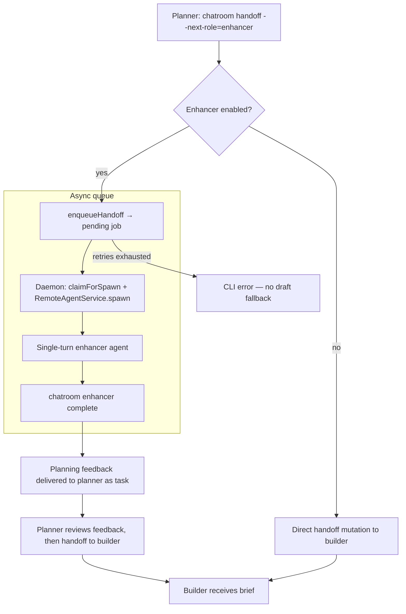

# Enhancers — Requirements & Implementation Plan

**Branch:** `feat/planner-enhancer-task-delivery`  
**PR:** #1113  
**Status:** Planner-aware workflow implemented (slices 2.0–2.6)

## Problem

Planner→builder handoffs are the primary delegation surface in duo teams. Planners often use capable but cheaper models for ongoing work; the delegation brief quality varies with context pressure and model capability. We want an **optional planning review phase** between planner and builder — the planner checks in with the enhancer, receives planning feedback, then proceeds to builder when ready. The enhancer critiques and improves the planning, but does not rewrite the builder brief.

## Goals

| #   | Goal                                      | Summary                                                                                       |
| --- | ----------------------------------------- | --------------------------------------------------------------------------------------------- |
| 1   | Single-turn planning critique             | One completion call; no tools, no research, no subagents                                      |
| 2   | Template-aware                            | Enhancer sees reference planner→builder template + produces planning feedback output          |
| 3   | Returns planning feedback to planner      | Enhancer output is a checklist/notes for planner review, not a rewritten builder brief        |
| 4   | CLI async queue on planner→enhancer       | Planner checks in via `chatroom handoff --next-role=enhancer`; daemon spawns enhancer session |
| 5   | User opt-in per chatroom, per instruction | User enables enhancer per chatroom; enhancer role injected via `buildAvailableHandoffRoles`   |

## Non-goals (v1)

- Rewriting planner briefs into builder-ready handoffs
- Multi-turn enhancer sessions or tool use
- Enhancer doing its own codebase research
- Replacing the planner agent — explicit planner check-in required when enabled

## Architecture Overview

See **[Shipped architecture](#shipped-architecture)** below — the mermaid diagram and module table there describe the production flow.

**Workflow (enhancer enabled):** `user → [loop planner → enhancer → planner → builder → planner] → user`

**Workflow (enhancer disabled):** `user → [loop planner → builder → planner] → user`

The remaining sections of this doc detail each component of the shipped flow.

## Shipped architecture



**Flow (enhancer enabled):** `user → [loop planner → enhancer → planner → builder → planner] → user` — one loop iteration per builder delegation round.

**Flow (enhancer disabled):** `user → [loop planner → builder → planner] → user`

Enhancement is **per builder delegation** when enabled. Planner **explicitly** hands off to `enhancer` before each `builder` delegation (including slice 2+ in multi-step tasks). **Same-slice rework** (planner → builder with feedback) does **not** re-trigger the enhancer. Enhancer returns **planning feedback** to planner, not an enhanced builder brief. Planner reviews feedback and proceeds to builder.

The target id `handoff:planner-to-builder` remains as a feature toggle id — it gates the planning-review phase before builder delegation, not a brief-rewriting operation.

### Key modules

| Layer             | Path                                                                        | Purpose                                                           |
| ----------------- | --------------------------------------------------------------------------- | ----------------------------------------------------------------- |
| Schema            | `services/backend/convex/schema.ts`                                         | `chatroom_enhancerConfigs` + `chatroom_enhancerJobs` tables       |
| Config sync       | `services/backend/convex/web/enhancer/mutations.ts`                         | `upsertConfig`, `disableConfig`                                   |
| Complete mutation | `services/backend/convex/web/enhancer/completeLogic.ts`                     | `applyEnhancerComplete` + planning feedback delivery              |
| CLI async queue   | `packages/cli/src/index.ts`                                                 | Commander action handler for `chatroom handoff`                   |
| Async delivery    | `packages/cli/src/commands/machine/daemon-start/enhancer/job-subscriber.ts` | Daemon claims jobs; planner receives feedback via `get-next-task` |
| Daemon jobs       | `services/backend/convex/daemon/enhancer/jobs.ts`                           | `pendingForMachine`, `claimForSpawn`                              |
| Spawn payload     | `services/backend/convex/daemon/enhancer/spawnPayload.ts`                   | `getSpawnPayload` with envelope + prompt                          |
| Daemon subscriber | `packages/cli/src/commands/machine/daemon-start/enhancer/job-subscriber.ts` | `pendingForMachine` subscription → spawn                          |
| System prompt     | `services/backend/prompts/enhancer/system-prompt.ts`                        | `renderEnhancerSystemPrompt`                                      |
| Task envelope     | `services/backend/prompts/enhancer/render-task-envelope.ts`                 | `renderEnhancerTaskEnvelope`                                      |
| Event types       | `apps/webapp/src/modules/chatroom/eventTypes/enhancerEvents.tsx`            | 4 event stream variants                                           |

---

## Core inputs to the enhancer

The enhancer prompt **must** include:

### 1. Handoff template (reference contract)

The enhancer receives the planner→builder handoff template as a **reference only** — to understand what the builder expects. The enhancer does not generate a builder brief; it generates **planning feedback** for the planner. The enhancer→planner feedback template is built into the enhancer system prompt.

Planner→builder template resolved server-side via `getHandoffTemplate()`:

```typescript
getHandoffTemplate({
  teamId: chatroom.teamId, // e.g. 'duo'
  fromRole: 'planner',
  toRole: 'builder',
  nativeIntegration: boolean, // from sender's harness capabilities
  chatroomId,
  role: 'planner',
  cliEnvPrefix,
});
```

Source: [services/backend/prompts/cli/handoff-templates/index.ts](services/backend/prompts/cli/handoff-templates/index.ts)  
Duo planner→builder body: [services/backend/prompts/teams/duo/handoff-templates/planner-to-builder.ts](services/backend/prompts/teams/duo/handoff-templates/planner-to-builder.ts)

### 2. Planner check-in (content to review)

The planner's draft handoff message body (markdown inside `---MESSAGE---` / heredoc), **before** it is delivered to the builder. The enhancer receives this as an XML check-in with three sections: `user-message`, `grounding`, `builder-handoff`.

### 3. Enhancement instructions (system)

Fixed system prompt constraints:

- Improve clarity, detail, and fidelity; preserve intent
- **Do not** add research, file reads, or new scope
- **Do not** change the handoff format — output must match template structure
- Return only the planning feedback markdown (no preamble)

---

## CLI contract: `chatroom enhancer complete`

Mirror `chatroom agentic-query complete` ([packages/cli/src/commands/agentic-query/complete.ts](packages/cli/src/commands/agentic-query/complete.ts)).

```bash
chatroom enhancer complete \
  --chatroom-id=<id> \
  --job-id=<id> \
  << 'CHATROOM_ENHANCER_END'
---MESSAGE---
<planning feedback markdown — review notes for planner, not a builder brief>
CHATROOM_ENHANCER_END
```

**Heredoc delimiter:** `CHATROOM_ENHANCER_END` (register in [services/backend/prompts/cli/stdin-heredoc.ts](services/backend/prompts/cli/stdin-heredoc.ts))

**CLI responsibilities:**

1. Authenticate session
2. Validate job exists and is `running`
3. Validate planning feedback body (non-empty; optional: section headers match expectations)
4. Persist feedback content on job record
5. Trigger delivery to planner as a planning review task (not a builder brief)
6. Mark job `complete`; dispose enhancer session

**Enhancer agent system prompt** must embed the complete command (like [renderAgenticQuerySystemPrompt](services/backend/prompts/agentic-query/system-prompt.ts)).

---

## Async queue: planner→enhancer check-in

**Triggered in** `chatroom handoff` CLI **before** calling `messages.handoff` mutation when:

- `nextRole === 'enhancer'` and `role === 'planner'`
- Chatroom has active enhancer config for `handoff:planner-to-builder`
- Enhancer config includes `agentHarness` + `model`

**Flow:**

1. Planner runs `chatroom handoff --next-role=enhancer` with planning check-in
2. CLI queues enhancer job (`chatroom_enhancerJobs`, status `pending`) via `enqueueHandoff`
3. Daemon spawns enhancer harness session (user-selected harness/model from config)
4. Task envelope delivered with template + check-in + complete command
5. Enhancer runs single turn → `chatroom enhancer complete`
6. Backend delivers **planning feedback** to planner as a new task
7. Planner reviews feedback, then handoff to builder when ready

**Enhancer failure behavior:** When enhancer enabled, **no fallback to draft**. Retries with exponential backoff (`ENHANCER_RETRY_BASE_MS` in `services/backend/config/reliability.ts`). After `ENHANCER_MAX_ATTEMPTS` retries, the CLI exits with error — the builder never receives the original draft.

---

## Config sync (implemented in slice 2.1)

Config is stored in both **localStorage** (cache) and `chatroom_enhancerConfigs` Convex table (SSOT). Table schema:

```typescript
{
  chatroomId,           // v.id('chatroom_rooms')
  userId,               // v.id('users')
  enabled: boolean,
  targetId: 'handoff:planner-to-builder',
  agentHarness: AgentHarness,
  model: string,
  machineId: string,    // workspace machine for harness spawn
  updatedAt: number,
}
```

Indexed by `(chatroomId, userId)` — per-user per-chatroom isolation.

**Webapp:** on Enable/Disable in dialog → `upsertConfig` / `disableConfig` mutation; hydrate from server on mount.

---

## Schema (implemented)

### `chatroom_enhancerJobs` (schema.ts)

Full table with indexes: `by_chatroom_status`, `by_machine_status`, `by_status_nextRetryAt`.

Key additional fields beyond initial sketch: `runningSince`, `attemptCount`, `maxAttempts`, `nextRetryAt`, `lastError`, `workingDir`, `pendingHandoffArgs` (stores sender/target info for handoff delivery on complete).

### Daemon integration

Not a new command table — enhancer jobs are claimed via `claimForSpawn` mutation (atomic `pending` → `running`), spawned via `RemoteAgentService.spawn()` directly, not the AgentProcessManager. Enhancer is **not** a chatroom team role — ephemeral worker session.

---

## Implementation phases

| Phase | Slice            | Deliverable                                                                       | Commit             |
| ----- | ---------------- | --------------------------------------------------------------------------------- | ------------------ |
| 0     | **2.0 (this)**   | `docs/plans/enhancers.md`                                                         | `d6bbde8b9`        |
| 1     | **2.1**          | Convex schema + `enhancerConfigs` sync from webapp                                | `84dd9be85`        |
| 2     | **2.2**          | `chatroom enhancer complete` CLI + prompts + mutation                             | `ee43e71a0`        |
| 3     | **2.3**          | CLI async queue on planner→enhancer check-in + job lifecycle + retries + delivery | `bd2647605`        |
| 4     | **2.4**          | Daemon spawn + single-turn session lifecycle                                      | `0dc4eae1a`        |
| 5     | **2.5** (merged) | Combined with 2.4 — same daemon lifecycle                                         | —                  |
| 6     | **2.6** (merged) | Integration tests (config, complete, handoff, spawn — 17 tests)                   | Across all commits |

---

## Task envelope (sketch)

**Path (proposed):** `services/backend/prompts/enhancer/render-task-envelope.ts`

The XML envelope delivered to the enhancer includes a `<planner-check-in>` section with three subsections (`user-message`, `grounding`, `builder-handoff`) instead of a flat `<draft-handoff>`:

```xml
<enhancer-job job-id="..." target="handoff:planner-to-builder">
  <handoff-template>
  ... resolved getHandoffTemplate output (reference) ...
  </handoff-template>
  <planner-check-in>
    <user-message>
    ... original user instruction that triggered this work ...
    </user-message>
    <grounding>
    ... relevant context/background for the planning review ...
    </grounding>
    <builder-handoff>
    ... planner's draft builder brief for critique ...
    </builder-handoff>
  </planner-check-in>
  <requirements>
  - Single-turn only. No tools. No research.
  - Return planning feedback for the planner (not a rewritten builder brief).
  - Highlight gaps, risks, and improvement suggestions.
  </requirements>
  <cli-complete-command>
  chatroom enhancer complete --chatroom-id=... --job-id=... << 'CHATROOM_ENHANCER_END'
  ...
  CHATROOM_ENHANCER_END
  </cli-complete-command>
</enhancer-job>
```

---

## Resolved decisions

| Decision                        | Resolution                                                                                                 |
| ------------------------------- | ---------------------------------------------------------------------------------------------------------- |
| Enhancer failure                | **No fallback.** Retries with exponential backoff; terminal failure surfaces CLI error, no draft delivered |
| Config scope                    | **Per user per chatroom** (matches localStorage key)                                                       |
| Harness spawn                   | **Remote agent** via daemon `RemoteAgentService.spawn()`                                                   |
| Template validation on complete | **None** — trust the enhancer; non-empty only                                                              |

---

## References

- Slice 1 UI: [apps/webapp/src/modules/chatroom/features/enhancers/](apps/webapp/src/modules/chatroom/features/enhancers/)
- Backend enhancer module: [services/backend/convex/web/enhancer/](services/backend/convex/web/enhancer/)
- Daemon enhancer module: [services/backend/convex/daemon/enhancer/](services/backend/convex/daemon/enhancer/)
- Enhancer prompts: [services/backend/prompts/enhancer/](services/backend/prompts/enhancer/)
- CLI complete command: [packages/cli/src/commands/enhancer/complete.ts](packages/cli/src/commands/enhancer/complete.ts)
- Daemon subscriber: [packages/cli/src/commands/machine/daemon-start/enhancer/](packages/cli/src/commands/machine/daemon-start/enhancer/) (async job delivery — no CLI poll loop)
- Handoff templates: [services/backend/prompts/cli/handoff-templates/](services/backend/prompts/cli/handoff-templates/)
- Agentic query plan: [docs/plans/agentic-search-ask.md](docs/plans/agentic-search-ask.md)
- Handoff mutation: [services/backend/convex/messages.ts](services/backend/convex/messages.ts) (`_handoffHandler` | `performHandoffFromEnhancer`)
- Integration tests: [services/backend/tests/integration/enhancer-config.spec.ts](services/backend/tests/integration/enhancer-config.spec.ts), [enhancer-complete.spec.ts](services/backend/tests/integration/enhancer-complete.spec.ts), [enhancer-handoff.spec.ts](services/backend/tests/integration/enhancer-handoff.spec.ts), [enhancer-spawn.spec.ts](services/backend/tests/integration/enhancer-spawn.spec.ts)
- Event stream types: [apps/webapp/src/domain/entities/event-stream-event.ts](apps/webapp/src/domain/entities/event-stream-event.ts)
- Event type registry: [apps/webapp/src/modules/chatroom/eventTypes/enhancerEvents.tsx](apps/webapp/src/modules/chatroom/eventTypes/enhancerEvents.tsx)
