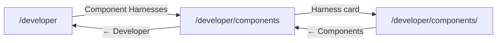

# Developer page conventions

Internal developer tooling lives under `/developer` in the webapp. These pages are **development-only** — production visitors are redirected to `/`. They complement the broader `/test` playground (feature demos and interactive tests) with focused **component compatibility harnesses**, especially for Safari/iOS regressions.

## Route tree

| Route                          | Purpose                                                                                             |
| ------------------------------ | --------------------------------------------------------------------------------------------------- |
| `/developer`                   | Landing index — links to developer sections (currently Component Harnesses)                         |
| `/developer/components`        | Registry-driven list of component harnesses with best practices and practices to avoid on each card |
| `/developer/components/<slug>` | Individual visual/compatibility harness (e.g. `date-picker`)                                        |

### Navigation chain

Each level includes a back link to its parent. The landing page also cross-links to `/test` for broader demos.

## Dev-only guards

1. **Parent guard** — `apps/webapp/src/app/developer/layout.tsx` redirects to `/` when `NODE_ENV !== 'development'`. Mirrors `apps/webapp/src/app/test/layout.tsx`.
2. **Belt-and-suspenders** — `apps/webapp/src/app/developer/components/layout.tsx` retains its own dev guard. Do not remove without confirming the parent layout covers all child routes.

## Registry SSOT

Harness metadata lives in a single typed registry:

- **File:** `apps/webapp/src/app/developer/components/registry.ts`
- **Export:** `componentHarnesses` — array of `ComponentHarness`
- **Fields:** `path`, `title`, `description`, `icon`, `badges`, `status`, `bestPractices`, `practicesToAvoid`

The components index page (`apps/webapp/src/app/developer/components/page.tsx`) maps over this registry. Cards show best practices (green styling) and practices to avoid (destructive styling) so developers browse guidance before opening a harness.

The landing page (`apps/webapp/src/app/developer/page.tsx`) uses a separate inline `developerSections` array for top-level section cards (not individual harnesses). This is intentional — sections describe categories; harnesses describe components.

## UI patterns

Follow the `/test` index pattern:

- Card grid with lucide icons, Badge status, hover scale/shadow transitions
- Dev-only note callout with link to sibling `/test` route
- Container: `container mx-auto px-4 py-8`, max width `max-w-6xl`

## Adding a new component harness

1. Create the harness page at `apps/webapp/src/app/developer/components/<slug>/page.tsx`.
2. Add a back link to `/developer/components` at the top of the harness page.
3. Add one entry to `componentHarnesses` in `registry.ts` with `bestPractices` and `practicesToAvoid` distilled from the harness content.
4. Do **not** hardcode cards on the components index — the registry drives rendering.

## Example: Date Picker harness

First harness at `/developer/components/date-picker`. Registry entry documents:

**Best practices:**

- Use `DatePickerField` from `@/components/ui/date-picker` (Popover + Calendar).
- Prefer modal popover; avoid native temporal inputs entirely.
- Test constrained parents (`max-w-md`) and side-by-side layouts on iOS Safari.

**Practices to avoid:**

- Native HTML temporal inputs (`date`, `datetime-local`, `time`, `month`, `week`) — width, alignment, and auto-selection bugs on iOS Safari.
- Assuming `ios-date-input-flex` fully fixes native input width in dark mode.

The harness page remains the authoritative deep-dive; the registry surfaces key patterns at browse time.

## Related

- [OKF document taxonomy](/architecture/okf-document-taxonomy.md)
- [What is OKF?](/development/what-is-okf.md)
- Code: `apps/webapp/src/app/developer/`
